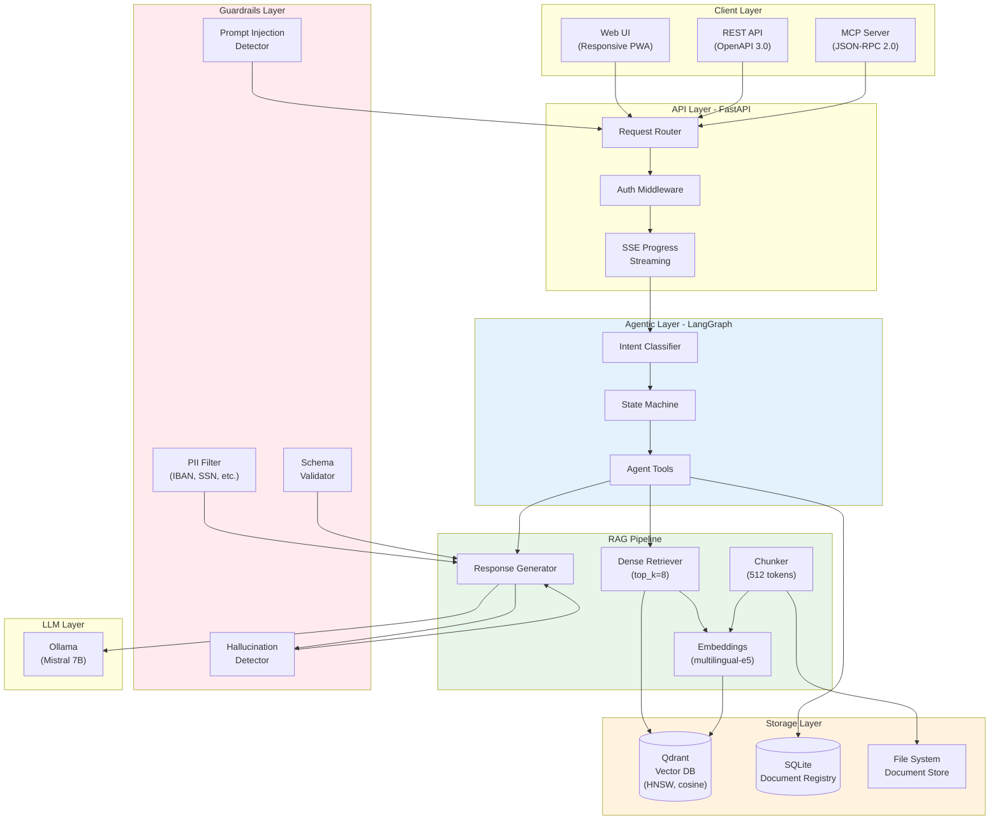
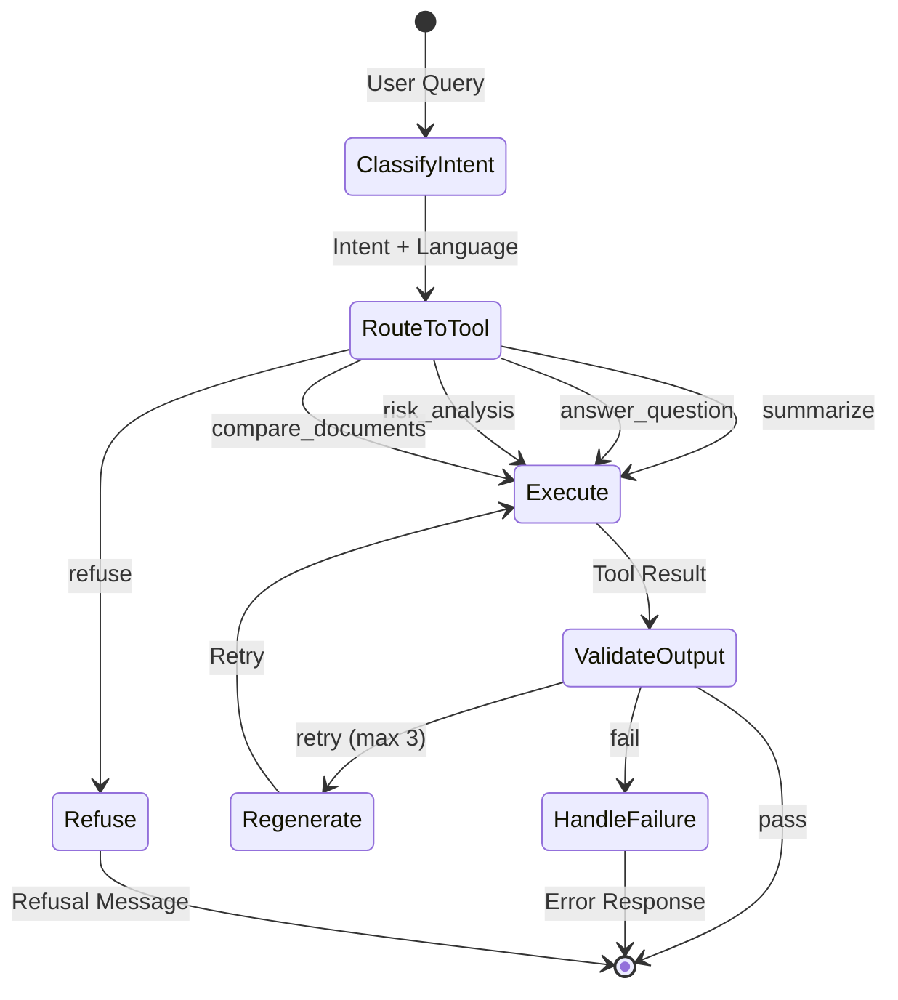
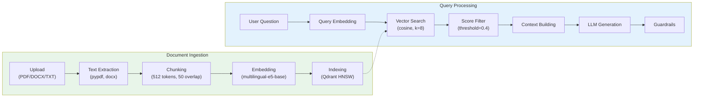
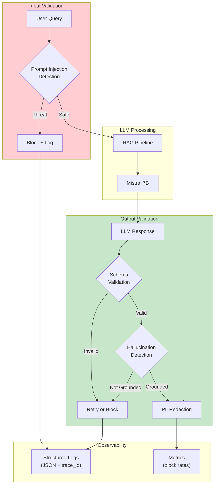
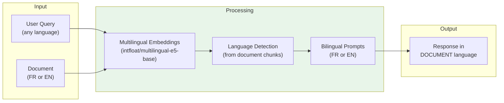

# Lexard

**Sovereign AI Contract Analysis with RAG & Agentic Architecture**

Lexard is a self-hosted B2B document intelligence solution that provides contract analysis, risk detection, Q&A with citations, and document comparison - all running locally without external API dependencies.

[](https://www.python.org/downloads/)
[](https://fastapi.tiangolo.com/)
[](https://www.langchain.com/langgraph)
[](https://qdrant.tech/)

---

## Features

- **RAG-Powered Q&A** - Ask questions with semantically retrieved citations
- **Risk Analysis** - Identify legal, financial, and operational risks automatically
- **Document Comparison** - Semantic diff between contract versions
- **Multilingual** - French/English with cross-language queries and document-language responses
- **AI Guardrails** - Hallucination detection, PII redaction, prompt injection blocking
- **MCP Protocol** - Model Context Protocol (JSON-RPC 2.0) for AI assistant integration
- **100% Sovereign** - No external API calls, all processing runs locally

---

## Architecture Overview



---

## LangGraph Agent Workflow

The agentic system uses LangGraph to orchestrate multi-step document analysis with automatic retry on validation failures:



**Agent Tools:**
| Tool | Description | Output |
|------|-------------|--------|
| `Summarizer` | Executive or detailed summaries | Structured summary with key points |
| `RiskDetector` | Legal, financial, operational risks | Categorized risks with severity |
| `DiffTool` | Semantic document comparison | Changes with similarity scores |

_Note: RAG-based Q&A is handled directly by the RAG pipeline, not as a separate agent tool._

---

## RAG Pipeline Details



**Key Parameters:**

- **Chunk size:** 512 tokens with 50 token overlap
- **Embedding model:** `intfloat/multilingual-e5-base` (768 dimensions, 100+ languages)
- **Vector index:** HNSW with cosine similarity
- **Retrieval:** top_k=8, score_threshold=0.4 (tuned for cross-lingual retrieval)
- **Response:** Returns "I cannot find relevant information" if no chunks meet threshold

---

## Guardrails Architecture

Multi-layer validation pipeline protecting inputs and outputs:



**Guardrails Components:**

| Component            | Purpose                     | Technique                                |
| -------------------- | --------------------------- | ---------------------------------------- |
| **Prompt Injection** | Block malicious prompts     | Pattern matching + heuristics            |
| **Hallucination**    | Ensure grounding in sources | N-gram overlap + semantic similarity     |
| **PII Filter**       | Redact sensitive data       | Regex patterns (IBAN, SSN, email, phone) |
| **Schema Validator** | Ensure response structure   | Pydantic models                          |

---

## Tech Stack

| Layer          | Technology            | Purpose                                       |
| -------------- | --------------------- | --------------------------------------------- |
| **API**        | FastAPI + Uvicorn     | Async REST API with OpenAPI docs              |
| **Agent**      | LangChain + LangGraph | Agentic workflow orchestration                |
| **Vector DB**  | Qdrant                | HNSW index, cosine similarity, 768-dim        |
| **Embeddings** | sentence-transformers | `intfloat/multilingual-e5-base`               |
| **LLM**        | Ollama                | Local inference (Mistral 7B, llama.cpp, vLLM) |
| **Guardrails** | Custom implementation | Multi-layer validation (no external libs)     |
| **Storage**    | SQLite + Filesystem   | Document registry + raw files                 |
| **Protocol**   | MCP (JSON-RPC 2.0)    | AI assistant integration                      |
| **UI**         | Vanilla JS + CSS      | Responsive PWA, mobile-friendly               |

---

## Quick Start

```bash
# Clone repository
git clone https://github.com/yourusername/lexard.git
cd lexard

# Start infrastructure
docker-compose up -d

# Pull LLM model
docker exec -it lexard-ollama ollama pull mistral:7b-instruct

# Setup Python environment
python -m venv .venv
source .venv/bin/activate
pip install -e ".[dev]"

# Start API server
uvicorn src.api.main:app --reload
```

Visit [http://localhost:8000](http://localhost:8000) for the Web UI.

---

## API Usage

### Upload Document

```bash
curl -X POST http://localhost:8000/upload \
  -F "file=@contract.pdf"
```

### Ask Question (with citations)

```bash
curl -X POST http://localhost:8000/query \
  -H "Content-Type: application/json" \
  -d '{
    "document_id": "doc-uuid",
    "question": "What is the termination clause?"
  }'
```

**Response:**

```json
{
  "answer": "The contract may be terminated with 30 days written notice...",
  "confidence": "high",
  "language": "en",
  "citations": [
    {
      "content": "Either party may terminate this agreement...",
      "page": 12,
      "score": 0.92
    }
  ]
}
```

### Risk Analysis

```bash
curl -X POST http://localhost:8000/risks \
  -H "Content-Type: application/json" \
  -d '{"document_id": "doc-uuid"}'
```

### Document Comparison

```bash
curl -X POST http://localhost:8000/compare \
  -H "Content-Type: application/json" \
  -d '{"doc_a": "uuid-1", "doc_b": "uuid-2"}'
```

### MCP Protocol (JSON-RPC 2.0)

```bash
curl -X POST http://localhost:8000/mcp \
  -H "Content-Type: application/json" \
  -d '{
    "jsonrpc": "2.0",
    "method": "ask_question",
    "params": {"document_id": "uuid", "question": "..."},
    "id": 1
  }'
```

---

## Project Structure

```
lexard/
├── src/
│   ├── api/              # FastAPI routes, middleware, schemas
│   │   ├── routes/       # Endpoint handlers
│   │   └── middleware.py # Auth, logging, CORS
│   ├── agent/            # LangGraph state machine
│   │   ├── graph.py      # Workflow definition
│   │   ├── classifier.py # Intent classification
│   │   └── tools/        # Summarizer, Risk, Diff
│   ├── rag/              # RAG pipeline
│   │   ├── pipeline.py   # Orchestration
│   │   ├── chunking.py   # Text chunking
│   │   ├── embeddings.py # Vector embeddings
│   │   ├── retriever.py  # Dense retrieval
│   │   └── extractors/   # PDF, DOCX, TXT
│   ├── guardrails/       # Validation layer
│   │   ├── hallucination.py
│   │   ├── prompt_injection.py
│   │   ├── pii.py
│   │   └── schema.py
│   ├── mcp/              # MCP JSON-RPC server
│   └── db/               # Qdrant + SQLite clients
├── ui/                   # Web interface
├── tests/                # Unit, integration, E2E tests
├── config/
│   └── config.yaml       # Externalized configuration
├── docs/                 # Documentation
└── docker-compose.yml    # Infrastructure
```

---

## Performance Targets

| Metric                           | Target  |
| -------------------------------- | ------- |
| Query latency (P95)              | < 3s    |
| Document ingestion (10 pages)    | < 15s   |
| Embedding generation (per chunk) | < 500ms |
| Concurrent queries               | 10      |
| Hallucination detection          | 90%+    |

Run `python tests/performance/benchmark.py` to measure actual performance on your hardware.

---

## Multilingual Support (French/English)

Lexard provides full bilingual support with intelligent language handling:



**Key Features:**

- **Cross-language retrieval** - Query in English, find French documents (and vice-versa)
- **Document-language responses** - Response language matches the document, not the query
- **Bilingual prompts** - System prompts in both French and English
- **Language detection** - Automatic detection from document chunks using `langdetect`

**Example:**

```bash
# French document uploaded, English query
curl -X POST http://localhost:8000/query \
  -d '{"document_id": "french-contract-uuid", "question": "What is the notice period?"}'

# Response in French (matches document language):
{
  "answer": "La période de préavis est de 30 jours...",
  "language": "fr",
  "citations": [...]
}
```

---

## Security & Sovereignty

- **No external API calls** - All processing local (Ollama, Qdrant)
- **PII redaction** - Automatic detection and masking
- **Prompt injection blocking** - Multi-pattern detection
- **Hallucination prevention** - Grounding validation against sources
- **Data isolation** - Documents never leave your infrastructure

---

## Documentation

- [Quickstart Guide](docs/quickstart.md)
- [API Reference](docs/api.md)
- [Configuration Guide](docs/configuration.md)
- [Multilingual Support](docs/multilingual.md)
- [Deployment Guide](docs/deployment.md)

Interactive API docs at `/docs` (Swagger) and `/redoc` (ReDoc).

---

## Requirements

- Python 3.11+
- Docker & Docker Compose
- 8GB RAM minimum (16GB recommended)
- 50GB disk space

---

## Development

```bash
# Run tests
pytest tests/ -v

# Run with coverage
pytest tests/ --cov=src --cov-report=html

# Type checking
mypy src/

# Linting
ruff check src/
```

**Git Workflow:** Gitflow with conventional commits (`feat:`, `fix:`, `docs:`, etc.)

---

## License

See [LICENSE](LICENSE) for details.

---

## Acknowledgments

Built with [FastAPI](https://fastapi.tiangolo.com/), [LangChain](https://www.langchain.com/), [LangGraph](https://www.langchain.com/langgraph), [Qdrant](https://qdrant.tech/), [Ollama](https://ollama.com/), and [sentence-transformers](https://www.sbert.net/).
